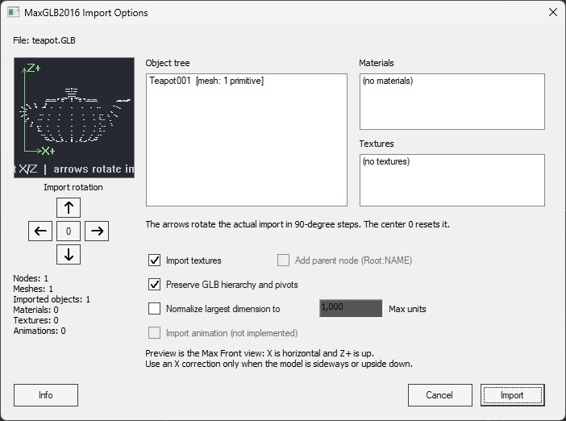

# MaxGLB2016

GLB import and export for Autodesk 3ds Max 2016, focused on practical static-model workflows.

<!--
Hero preview before the first public release:
1. Add docs/images/hero-preview.png
2. Uncomment the block below.

<p align="center">
  
</p>
-->

> **Status:** early public preview. MaxGLB2016 is intentionally narrow in scope: static triangle-mesh models, useful material conversion, and reliable GLB round-trips in 3ds Max 2016.

## Why this project exists

Modern GLB assets are still useful in older production pipelines, but Autodesk 3ds Max 2016 has no built-in glTF/GLB workflow. MaxGLB2016 adds a native x64 importer and exporter without trying to turn Max 2016 into a complete modern glTF authoring environment.

The goal is simple: import one or more static GLB models, optimize or edit them in Max, arrange the scene, and export the scene or selection back to GLB.

## Current features

### Import

- Binary glTF 2.0 (`.glb`) files with embedded geometry and PNG/JPEG textures
- Multiple scene nodes and multiple mesh primitives
- Optional parent node and hierarchy preservation
- Standard glTF Y-up to 3ds Max Z-up conversion
- Optional model-size normalization
- `POSITION`, `NORMAL`, `TEXCOORD_0`, and `TEXCOORD_1`
- Explicit Max normals
- Multiple primitives converted to Material IDs / Multi/Sub-Object materials
- Base color, normal, metallic/roughness, occlusion, and emissive textures
- Alpha modes and base-color alpha handling
- `doubleSided`
- `KHR_texture_transform`
- Sampler wrap modes: repeat, clamp-to-edge, and mirrored repeat
- Sampler filtering preserved for round-trip export, with the closest available Max bitmap fallback
- `KHR_materials_transmission` factor represented with a Max Standard glass fallback
- Metallic and roughness factors preserved for round trips
- Progress display, cancellation, and a single-step undo for imports

### Export

- Complete scene or selected nodes
- Embedded GLB geometry and textures
- Optional transform baking or transform/hierarchy preservation
- Material IDs and Multi/Sub-Object materials
- Base color, normal, ORM, emissive, opacity, and alpha settings
- `TEXCOORD_0` and `TEXCOORD_1`
- `KHR_texture_transform` round trips
- Sampler wrap/filter round trips
- `doubleSided`
- `KHR_materials_transmission` factor round trips
- Metallic and roughness factor round trips
- Progress display and cancellation
- Optional export summary
- Optional reveal-in-Explorer after export

## Deliberate limitations

MaxGLB2016 is not intended to compete with Blender or newer DCC glTF pipelines.

The current public-preview scope does **not** include:

- Text-based `.gltf` scenes with external resources
- Animation
- Skinning or skeletal rigs
- Morph targets
- Cameras or lights
- Full Physical Material conversion
- Full support for every glTF extension
- Authoring of `KHR_materials_clearcoat`, `KHR_materials_volume`, or `KHR_materials_ior`
- Transmission textures

Unsupported material features may use a visual Max fallback or remain unavailable for editing. Test important production assets before replacing the original GLB.

## Installation

### Prebuilt release

1. Download the release ZIP for 3ds Max 2016 x64.
2. Extract `MaxGLB2016.dle`.
3. Copy it into a 3ds Max plug-in directory, or add its folder under **Customize → Configure System Paths → 3rd Party Plug-Ins**.
4. Restart 3ds Max 2016.
5. Use **File → Import** or **File → Export** and select GLB.

Do not copy PDB files unless you are debugging the plug-in.

## Building from source

### Requirements

- Autodesk 3ds Max 2016 SDK
- Visual Studio 2012 / Visual C++ toolchain compatible with the Max 2016 SDK
- Windows x64
- Git submodules are not required; `cgltf` is included under `third_party/cgltf`

### SDK environment variable

Create a user or system environment variable named:

```text
MAXSDK_2016
```

Set it to the root folder of the Autodesk 3ds Max 2016 SDK. That folder must contain the SDK `ProjectSettings` directory used by the Autodesk property sheets.

Example shape only:

```text
D:\SDKs\3ds Max 2016 SDK
```

Do not commit your personal SDK path into the project files.

### Build steps

1. Open `MaxGLB2016.sln`.
2. Select `Release | x64`.
3. Build the solution.
4. The plug-in is created at:

```text
src\MaxGLB.Importer\bin\x64\Release\MaxGLB2016.dle
```

## Testing

The project has been exercised with official Khronos sample assets, including:

- `TextureTransformMultiTest.glb`
- `TextureSettingsTest.glb`
- `ChronographWatch.glb`

The sample assets themselves are not included in this repository. Validate important exports in more than one independent glTF viewer.

## Repository layout

```text
MaxGLB2016.sln
src/MaxGLB.Importer/    Plug-in source and Visual Studio project
third_party/cgltf/      Bundled cgltf source and license
docs/                   Documentation and future screenshots
```

## Contributing

Bug reports, focused fixes, documentation improvements, and reproducible test cases are welcome. Please read [CONTRIBUTING.md](CONTRIBUTING.md) before submitting a pull request.

The project intentionally prioritizes static-model reliability over a broad feature list.

## License

MaxGLB2016 is released under the MIT License. See [LICENSE](LICENSE).

Third-party notices are listed in [THIRD_PARTY_NOTICES.md](THIRD_PARTY_NOTICES.md).

## Author

Martin Hoeglund
